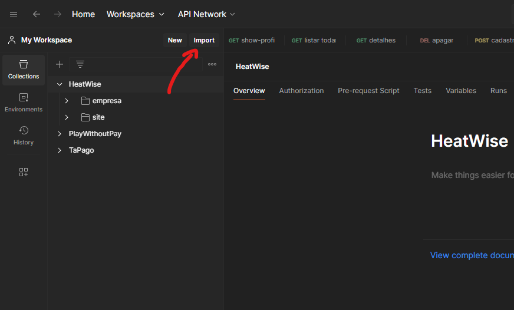
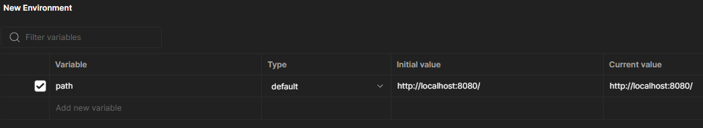

# Teste de endpoints
Para testar os endpoints do site, basta importar o arquivo "HeatWise.postman_collection.json" em uma plataforma como Postman ou Insomnia: 
 
Também é importante configurar a variável para o caminho que a aplicação está rodando 
 
Desta forma será possivel testar os endpoints adequadamente